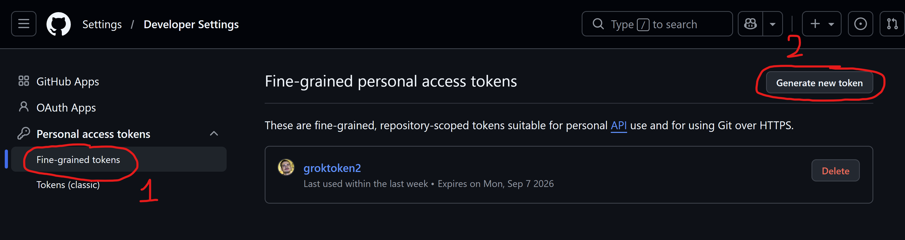
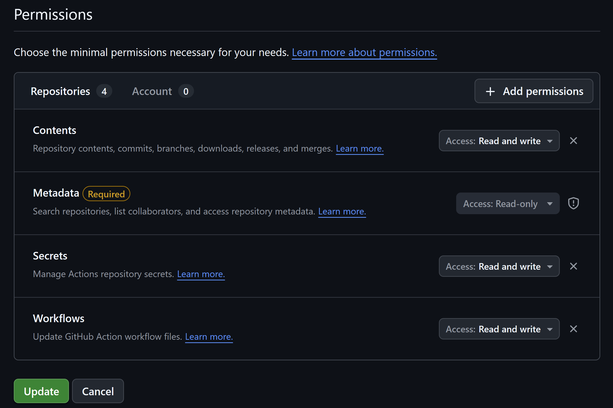
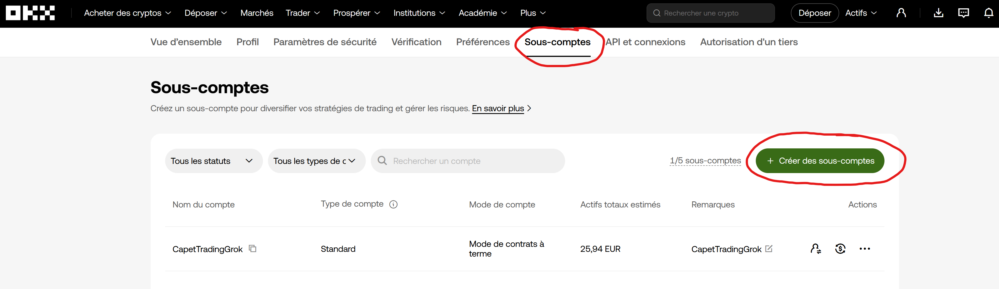

# Achats planifiés sur OKX (style DCA)

**OKX ne propose pas nativement un vrai plan d’achats récurrents simple (DCA Spot).**  
Ce projet comble ce manque : vous choisissez **quoi**, **combien** et **quand** —  
GitHub Actions exécute les achats **Spot au marché**, même si votre PC est éteint.  
Pour programmer ces achats avec GitHub Actions, il faut un **compte GitHub** (gratuit) : https://github.com/signup

---

## En une phrase

Un **planificateur d’achats crypto sur OKX** (ex. 1 USDC de SOL tous les X jours),  
open source, piloté par **GitHub Actions**, utilisable en dépôt **public ou privé**.

Ce n’est **pas** un bot de trading prédictif.  
Ce n’est **pas** un conseil financier.

---

## Le plus simple : une phrase à coller dans une IA

Ouvrez **ChatGPT**, **Grok**, **Claude**, **Cursor** sur votre ordinateur ou dans **Hermes Agent** / **OpenClaw**, et donnez ce prompt à votre agent IA :

```text
Installe ce projet pour moi et guide moi : https://github.com/Capetlevrai/okx-planifier-achat-github-actions
```

L’agent lit [AGENTS.md](AGENTS.md), vous pose les questions une par une  
(crypto, montant, rythme, démo ou réel), crée **obligatoirement un dépôt privé**  
à partir de ce template, configure les secrets,  
et **demande confirmation avant tout achat réel**.

Parcours agent (dépôt **toujours privé**) :

```bash
gh repo create <nom-du-dépôt> --private --template Capetlevrai/okx-planifier-achat-github-actions
```

### Si l’agent demande un token GitHub

Créez un **fine-grained personal access token** limité à **votre** dépôt :  
https://github.com/settings/personal-access-tokens

Permissions à cocher :

- **Contents** : Read and write  
- **Workflows** : Read and write  
- **Secrets** : Read and write  
- **Metadata** : Read-only





Révoquez le token après installation.

Autres prompts : [docs/AGENT_PROMPTS.md](docs/AGENT_PROMPTS.md).

---

## Si vous souhaitez procéder à la main sans IA

1. **[Use this template](../../generate)** → créez votre dépôt et choisissez **Private** dans le menu (recommandé pour l’argent réel).
2. **[Créez une clé API OKX](https://my.okx.com/fr-fr/account/my-api)** : **Lecture + Trading** uniquement — **jamais Retrait**.
3. Assurez-vous d’avoir des devises disponibles sur votre compte **Trading** (ex. USDC) : les fonds sont souvent sur le compte **Funding** par défaut — [transférez-les vers Trading](https://my.okx.com/fr-fr/balance/transfer) si besoin. Pour plus de sécurité, utilisez un **[sous-compte](https://my.okx.com/fr-fr/account/sub-account)** dédié.
4. Collez les secrets dans GitHub : `OKX_API_KEY`, `OKX_API_SECRET` (ou `OKX_SECRET_KEY`), `OKX_PASSPHRASE`.
5. Actions → **1. Configurer mon plan** → choisissez paires, montants, rythme.
6. Testez d’abord en **démo**, puis un **tout petit** montant réel si vous le souhaitez.

Détails dépôt privé : [docs/REPO_PRIVE.md](docs/REPO_PRIVE.md).

---

## Premier achat réel

Avant d’engager de l’argent :

👉 **[docs/GUIDE_ACHAT_REEL.md](docs/GUIDE_ACHAT_REEL.md)**

Points critiques :

- fonds sur **Trading**, pas seulement **Funding** ;
- clé API en mode **réel** (pas démo) ;
- secret d’armement exact : `ALLOW_REAL_TRADING` = `I_CONFIRM_REAL_SPOT_BUYS` ;
- petit montant d’abord.

Sécurité détaillée : [docs/SECURITE.md](docs/SECURITE.md).

---

## Ce que fait l’outil / ce qu’il ne fait pas

| Il fait | Il ne fait pas |
|---|---|
| Achats Spot OKX **au marché**, selon un planning | Trading futures / marge / “signaux” |
| Exécution via **GitHub Actions** (PC éteint OK) | Virements bancaires ou retraits |
| Démo ou réel, public ou privé | Garantir un profit |
| Tableau de bord dans le dépôt (`RAPPORT.md`) | Remplacer un conseil en investissement |

---

## Tableau de bord

- Public (exemple) : https://capetlevrai.github.io/okx-planifier-achat-github-actions/
- Dans votre dépôt : `RAPPORT.md` et `tableau-de-bord.html`  
  (idéals en **privé** si GitHub Pages n’est pas disponible)
- Historique OKX (compte réel) :  
  https://my.okx.com/fr-fr/balance/report-center/unified/account-history

---

## Sécurité (essentiel)

- **Jamais** la permission Retrait sur la clé API.
- Secrets **uniquement** dans GitHub Actions — jamais dans le code.
- Préférez un **[sous-compte](https://my.okx.com/fr-fr/account/sub-account)** avec un petit budget.
- Un **keepalive** maintient la clé active (appel solde, sans ordre).
- Une clé collée en clair doit être **révoquée**, idéalement avec un **[sous-compte](https://my.okx.com/fr-fr/account/sub-account)** dédié.



---

## Pour aller plus loin

| Doc | Contenu |
|---|---|
| [AGENTS.md](AGENTS.md) | Protocole complet pour les agents IA |
| [docs/GUIDE_ACHAT_REEL.md](docs/GUIDE_ACHAT_REEL.md) | Checklist premier achat réel |
| [docs/REPO_PRIVE.md](docs/REPO_PRIVE.md) | Utilisation en dépôt privé |
| [docs/SECURITE.md](docs/SECURITE.md) | Règles de sécurité |
| [docs/AGENT_PROMPTS.md](docs/AGENT_PROMPTS.md) | Prompts prêts à copier |

---

## Avertissement

Outil technique open source (MIT). Les crypto-actifs sont volatils.  
Vous restez seul responsable des ordres passés sur votre compte OKX.

Réalisé par **Capetlevrai** ·  
[X](https://x.com/capetlevrai) ·  
[Discord](https://discord.gg/VmBa7f9ZAt) ·  
[Twitch](https://www.twitch.tv/capetlevrai) ·  
[YouTube](https://www.youtube.com/@CAPETCRYPTO)
