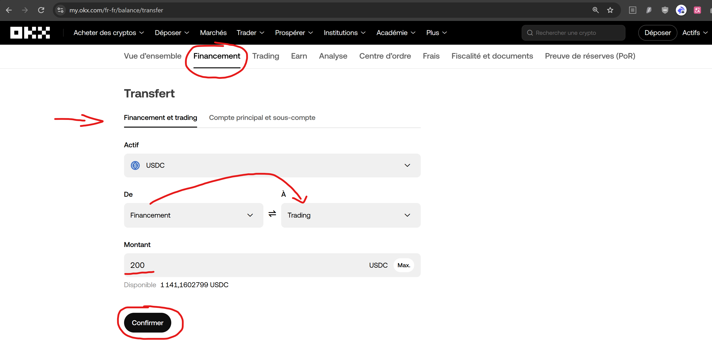

# Achats planifiés sur OKX (style DCA)

**OKX ne propose pas nativement un vrai plan d’achats récurrents simple (DCA Spot).**  
Ce projet comble ce manque : vous choisissez **quoi**, **combien** et **quand** —  
GitHub Actions exécute les achats **Spot au marché**, même si votre PC est éteint.  
Pour programmer ces achats avec GitHub Actions, il faut un **compte GitHub** (gratuit) : https://github.com/signup

---

## En une phrase

Un **planificateur d’achats crypto sur OKX** (ex. 50 USDC de BTC tous les 15 jours),  
open source, piloté par **GitHub Actions**, utilisable en dépôt **public ou privé**.

Ce n’est **pas** un bot de trading prédictif.  
Ce n’est **pas** un conseil financier.

---

## Le plus simple : une phrase à coller dans une IA

Ouvrez **ChatGPT**, **Grok**, **Claude**, **Cursor** sur votre ordinateur ou dans **Hermes Agent** / **OpenClaw**, et donnez ce prompt à votre agent IA :

```text
Installe ce projet pour moi et guide moi : https://github.com/Capetlevrai/okx-planifier-achat-github-actions
```

L’agent lit [AGENTS.md](AGENTS.md), commence par deux choix cliquables —
**Démo ou Argent réel**, puis **Europe/EEE, États-Unis, Turquie ou Ailleurs** —
et, en argent réel, propose un **sous-compte dédié** avant toute clé API. Il
crée **obligatoirement un dépôt privé** à partir de ce template, configure les secrets,
et **demande confirmation avant tout achat réel**.

Le parcours ne doit pas se limiter à une succession de questions. Avant chaque
choix, l'agent explique en quelques phrases **pourquoi l'étape existe**, ce que
votre réponse change, ce qui reste désactivé et ce que vous devez faire. Il ne vous
demande jamais de coller une clé API dans le chat. Consultez le
[parcours guidé détaillé](docs/PARCOURS_GUIDE.md) pour voir exactement les étapes
et les liens qui doivent vous être présentés.

Les pages OKX sensibles ne sont pas ouvertes dans un navigateur intégré :
l'agent vous donne l'URL officielle à ouvrir vous-même dans votre navigateur
habituel. Ne transmettez jamais clé, secret ou passphrase dans le chat.

Parcours agent (dépôt **privé pour plus de sécurité**) :

```bash
gh repo create <nom-du-dépôt> --private --template Capetlevrai/okx-planifier-achat-github-actions
```

### Si l’agent demande un token GitHub

Créez un **fine-grained personal access token** limité à **votre** dépôt :  
https://github.com/settings/personal-access-tokens

Permissions à cocher :

- **Contents** : Read and write  
- **Workflows** : Read and write  
- **Secrets** : Read and write  
- **Metadata** : Read-only


Révoquez le token après installation.

Autres prompts : [docs/AGENT_PROMPTS.md](docs/AGENT_PROMPTS.md).

---

## Si vous souhaitez procéder à la main sans IA

1. **[Use this template](../../generate)** → créez votre dépôt et choisissez **Private** dans le menu (recommandé pour l’argent réel).
2. En argent réel, choisissez d'abord entre un **[sous-compte dédié](https://my.okx.com/fr-fr/account/sub-account)** avec budget limité (recommandé) et votre compte principal.
3. **[Créez ensuite la clé API OKX](https://my.okx.com/fr-fr/account/my-api)** sur le compte choisi : **Lecture + Trading** uniquement — **jamais Retrait**.
4. Transférez le budget du compte principal vers le sous-compte depuis [cette page OKX](https://my.okx.com/fr-fr/balance/sub-transfer), avec une petite marge pour les frais. Vérifiez ensuite qu'il est disponible sur **Trading** ; sinon, [déplacez-le de Funding vers Trading](https://my.okx.com/fr-fr/balance/transfer).
5. Ouvrez **Settings → Environments**, cliquez sur la grande carte **`real-trading`**, puis descendez jusqu'à **Environment secrets**. Cliquez sur **Add environment secret** pour ajouter `OKX_API_KEY`, `OKX_API_SECRET` (ou `OKX_SECRET_KEY`) et `OKX_PASSPHRASE`, un par un. **Utilisez Environment secrets, jamais Environment variables** : le workflow ne lit pas les variables comme identifiants OKX.
6. Actions → **1. Configurer mon plan** → choisissez paires, montants, rythme.
7. Testez d’abord en **démo**, puis un **tout petit** montant réel si vous le souhaitez.

### Accès directs OKX Europe/EEE

Ouvrez ces pages vous-même dans votre navigateur habituel. Si vous n'êtes pas
connecté, OKX affiche d'abord la connexion puis revient automatiquement à la
rubrique demandée.

1. [Créer ou gérer un sous-compte dédié](https://my.okx.com/fr-fr/account/sub-account)
2. [Transférer le budget du compte principal vers le sous-compte](https://my.okx.com/fr-fr/balance/sub-transfer)
3. [Déplacer ensuite les fonds de Funding vers Trading si nécessaire](https://my.okx.com/fr-fr/balance/transfer)
4. [Créer la clé API sur le compte choisi](https://my.okx.com/fr-fr/account/my-api)
5. [Consulter ensuite l'historique Spot](https://my.okx.com/fr-fr/balance/report-center/unified/account-history)

Pour comprendre le choix avant d'agir :
[guide officiel des sous-comptes](https://www.okx.com/fr-fr/help/what-is-a-sub-account)
et [FAQ officielle sous-comptes/API](https://www.okx.com/fr-fr/help/subaccounts-account-mode-and-api-connections-faq).

Pour un premier achat réel « maintenant », suivez le [parcours en une fois](docs/GUIDE_ACHAT_REEL.md#premier-achat-immédiat--le-parcours-en-une-fois) : après votre confirmation finale, l'agent active le planning, exécute immédiatement un seul achat et vérifie qu'il est bien rempli avant de vous répondre.

Détails dépôt privé : [docs/REPO_PRIVE.md](docs/REPO_PRIVE.md).

---

## Premier achat réel

Avant d’engager de l’argent :

👉 **[docs/GUIDE_ACHAT_REEL.md](docs/GUIDE_ACHAT_REEL.md)**

Points critiques :

- Les fonds doivent être dispo sur votre compte de **Trading**, pas dans **Financement** (voir image) : https://my.okx.com/fr-fr/balance/transfer
- clé API en mode **réel** (pas démo) ;
- confirmation finale distincte avant que l'agent active les achats ;
- petit montant d’abord.

Sécurité détaillée : [docs/SECURITE.md](docs/SECURITE.md).



---

## Ce que fait l’outil / ce qu’il ne fait pas

| Il fait | Il ne fait pas |
|---|---|
| Achats Spot OKX **au marché**, selon un planning | Trading futures / marge / “signaux” |
| Exécution via **GitHub Actions** (PC éteint OK) | Virements bancaires ou retraits |
| Démo ou réel, public ou privé | Garantir un profit |
| Tableau de bord dans le dépôt (`RAPPORT.md`) | Remplacer un conseil en investissement |

---

## Tableau de bord

- Public (exemple) : https://capetlevrai.github.io/okx-planifier-achat-github-actions/
- Dans votre dépôt : `RAPPORT.md` et `tableau-de-bord.html`  
  (idéals en **privé** si GitHub Pages n’est pas disponible)
- Historique OKX (compte réel) :  
  https://my.okx.com/fr-fr/balance/report-center/unified/account-history

Après chaque achat, l'agent doit remettre à l'utilisateur **deux liens** : le
tableau de bord et l'historique OKX. Pour une copie privée, le tableau de bord
est le rapport GitHub `https://github.com/<pseudo>/<dépôt>/blob/main/RAPPORT.md`.
Pour une copie publique dont GitHub Pages est activé, c'est
`https://<pseudo>.github.io/<dépôt>/` comme dans l'exemple ci-dessus.

---

## Sécurité (essentiel)

- **Jamais** la permission Retrait sur la clé API.
- Secrets **uniquement** dans GitHub Actions — jamais dans le code.
- Préférez un **[sous-compte](https://my.okx.com/fr-fr/account/sub-account)** avec un petit budget.
- Un **keepalive** maintient la clé active (appel solde, sans ordre).
- Une clé collée en clair doit être **révoquée** idéalement.


---

## Pour aller plus loin

| Doc | Contenu |
|---|---|
| [AGENTS.md](AGENTS.md) | Protocole complet pour les agents IA |
| [docs/PARCOURS_GUIDE.md](docs/PARCOURS_GUIDE.md) | Parcours expliqué, étape par étape, avec liens directs |
| [docs/GUIDE_ACHAT_REEL.md](docs/GUIDE_ACHAT_REEL.md) | Checklist premier achat réel |
| [docs/REPO_PRIVE.md](docs/REPO_PRIVE.md) | Utilisation en dépôt privé |
| [docs/SECURITE.md](docs/SECURITE.md) | Règles de sécurité |
| [docs/AGENT_PROMPTS.md](docs/AGENT_PROMPTS.md) | Prompts prêts à copier |

---

## Avertissement

Outil technique open source (MIT). Les crypto-actifs sont volatils.  
Vous restez seul responsable des ordres passés sur votre compte OKX.

Réalisé par **Capetlevrai** ·  
[X](https://x.com/capetlevrai) ·  
[Discord](https://discord.gg/VmBa7f9ZAt) ·  
[Twitch](https://www.twitch.tv/capetlevrai) ·  
[YouTube](https://www.youtube.com/@CAPETCRYPTO)
