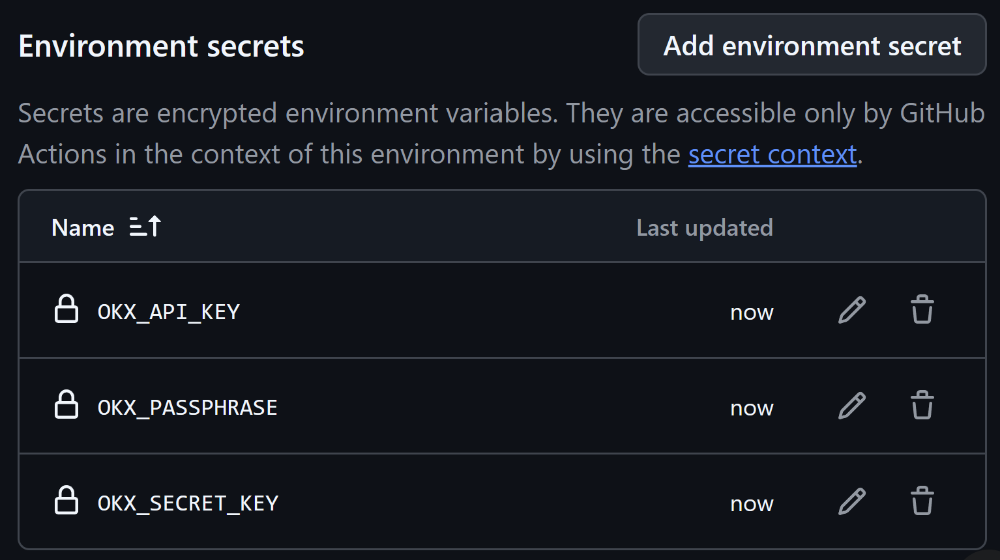

# Utiliser le planificateur en dépôt **privé**

GitHub Actions fonctionne très bien sur un dépôt **privé** (y compris avec le
plan Free). C’est le mode recommandé si vous ne voulez pas exposer planning,
historique ou montants.

Ce guide reprend une copie privée de validation :
**[Capetlevrai/okx-planifier-prive-06-08](https://github.com/Capetlevrai/okx-planifier-prive-06-08)**
(dépôt privé de démonstration, non destiné à être public).

---

## Public vs privé — quoi change vraiment ?

| Sujet | Dépôt **public** | Dépôt **privé** |
|---|---|---|
| GitHub Actions (CI, DCA, keepalive, setup) | ✅ | ✅ **identique** |
| Secrets Actions + env `real-trading` | ✅ | ✅ **identique** |
| Cron horaire / keepalive | ✅ | ✅ **identique** |
| Visibilité du code et de `data/` | Tout le monde | **Seulement vous** (+ collaborateurs) |
| GitHub Pages gratuit | Simple | **Souvent indisponible** sur Free (Pages privé = offre payante) |
| Consulter le tableau de bord | URL Pages | **`RAPPORT.md`** et **`tableau-de-bord.html`** dans le dépôt |

En résumé : **l’automatisation des achats ne dépend pas du caractère public**.
Seul l’hébergement web gratuit de l’interface change.

---

## Créer votre copie privée (recommandé)

### Option A — Template GitHub

1. Ouvrez le dépôt modèle (public tutoriel) :
   https://github.com/Capetlevrai/okx-planifier-achat-github-actions  
2. **Use this template** → *Create a new repository*  
3. Cochez **Private**  
4. Créez le dépôt

### Option B — Fork puis passage en privé

Un fork d’un dépôt public reste lié au réseau public. Préférez le **template**
ou un clone + `gh repo create --private`.

### Option C — Ligne de commande

```bash
git clone https://github.com/Capetlevrai/okx-planifier-achat-github-actions.git mon-okx-dca
cd mon-okx-dca
gh repo create mon-pseudo/mon-okx-dca-prive --private --source=. --remote=origin --push
```

---

## Secrets et environnement (même logique qu’en public)

1. **Settings → Environments → New environment** : nommez-le `real-trading`  
   (sans approbateurs si vous voulez un cron 100 % automatique).

2. Dans **Settings → Environments**, cliquez sur la grande carte
   **`real-trading`** au milieu de la page (pas sur l'icône corbeille). Sur la
   page suivante, descendez jusqu'à **Environment secrets**, puis cliquez sur
   **Add environment secret** pour ajouter chaque identifiant. **Utilisez
   Environment secrets, jamais Environment variables** : le workflow lit les
   identifiants uniquement depuis `secrets.*`.

   

| Secret | Rôle |
|---|---|
| `OKX_API_KEY` | Clé API live |
| `OKX_API_SECRET` ou `OKX_SECRET_KEY` | Secret API |
| `OKX_PASSPHRASE` | Passphrase API |

```bash
gh secret set OKX_API_KEY --repo VOTRE_PSEUDO/VOTRE_DEPOT
gh secret set OKX_API_SECRET --repo VOTRE_PSEUDO/VOTRE_DEPOT
gh secret set OKX_PASSPHRASE --repo VOTRE_PSEUDO/VOTRE_DEPOT
```

Pour l’environnement :

```bash
gh secret set OKX_API_KEY --repo VOTRE_PSEUDO/VOTRE_DEPOT --env real-trading
# … idem pour les autres
```

3. Permissions clé OKX : **Lecture + Trading**, pas Retrait.  
   Fonds d’achat sur le compte **Trading** (pas seulement Funding).  
   Voir [GUIDE_ACHAT_REEL.md](./GUIDE_ACHAT_REEL.md).

---

## Vérifier que Actions marchent en privé

Dans l’onglet **Actions** de votre dépôt privé :

| Workflow | Attendu |
|---|---|
| **0. ⛔ ARRÊT D'URGENCE — Couper tous les achats** | Bouton simple pour désactiver les achats et demander l'annulation des runs actifs |
| **1. 🗓️ PLANNING — Créer ou modifier mes achats** | Formulaire pour régénérer le plan |
| **2. 💳 ACHATS — Exécuter le planning automatiquement** | Dispatch manuel avec `dry_run=1` → job `execute-demo` ou `execute-real` en **SIMULATION** |
| **3. 🔐 CLÉ OKX — Maintenir la connexion (aucun achat)** | Tourne chaque jour (06:00 UTC), aucun ordre |
| **4. 📊 TABLEAU DE BORD — Mettre à jour l’affichage** | Peut être **ignoré / sauté** en privé Free (voir ci-dessous) |
| **5. ✅ SÉCURITÉ — Vérifier le projet (aucun achat)** | Vert après chaque push pertinent |
| **6. ⚠️ EXPERT — Test réel SOL (1 + 1 USDC)** | Test spécialisé, à ignorer dans un usage normal |

Test manuel sans acheter :

```bash
gh workflow run "2. 💳 ACHATS — Exécuter le planning automatiquement" \
  --repo VOTRE_PSEUDO/VOTRE_DEPOT \
  -f dry_run=1
```

Dans les logs, vous devez voir par exemple :

```text
Mode : compte RÉEL (argent réel) · SIMULATION, aucun ordre transmis · …
```

ou le mode démo selon votre `data/plan.json`.

---

## Tableau de bord sans GitHub Pages

Sur un dépôt **privé Free**, l’historique et le planning se consultent ainsi :

| Fichier | Où le lire |
|---|---|
| [RAPPORT.md](../RAPPORT.md) | Rendu Markdown sur GitHub (privé = visible par vous) |
| [tableau-de-bord.html](../tableau-de-bord.html) | Fichier du dépôt (ouvrir en raw / local) |
| `data/plan.json` | Planning machine |
| `data/history.json` | Achats enregistrés par le bot |

Ces fichiers sont mis à jour par le workflow **2. 💳 ACHATS** après chaque run
(commit bot `[skip ci]`).

Après un achat rempli, l'agent doit donner ce lien directement à l'utilisateur :

```text
https://github.com/<VOTRE_PSEUDO>/<VOTRE_DEPOT>/blob/main/RAPPORT.md
```

Il s'agit du tableau de bord consultable de la copie privée. L'agent doit aussi
donner le lien d'historique OKX de la région du compte (Europe/EEE :
`https://my.okx.com/fr-fr/balance/report-center/unified/account-history`).

En local :

```bash
npm run site -- -l tcp://127.0.0.1:4173
# puis http://127.0.0.1:4173/site/ ou /tableau-de-bord.html
```

### GitHub Pages en privé

- Compte **Free** + dépôt **privé** : le déploiement Pages échoue en général
  (`Failed to create deployment` / Pages non activé).
- Compte **Pro / Team** : vous pouvez activer Pages en privé puis, si besoin,
  définir la variable de dépôt `ENABLE_PRIVATE_PAGES=true` pour forcer le job
  de déploiement (voir workflow `pages.yml`).

Ce n’est **pas** requis pour que les achats automatiques fonctionnent.

---

## Cas validé (référence)

Sur le dépôt privé de démo `okx-planifier-prive-06-08` :

1. Dépôt créé en **Private**, code poussé depuis le projet public.  
2. Secrets repo + environnement `real-trading` configurés.  
3. **CI** : success.  
4. **2. 💳 ACHATS** (`dry_run=1`) : success, job `execute-real`, mode simulation,
   secrets masqués `***`.  
5. **Pages** : échec attendu sans offre Pages privée — sans impact sur le DCA.  
6. Keepalive : même workflow quotidien que le public.

Conclusion : **copier en privé et automatiser est supporté** ; gardez juste le
tableau de bord via les fichiers du dépôt plutôt que Pages gratuit.

---

## Bonnes pratiques en privé

1. Ne partagez le dépôt qu’avec des collaborateurs de confiance (ils voient
   le code et l’historique commité, **pas** les valeurs des secrets).  
2. Même en privé, **ne commitez jamais** `.env` ni une clé en clair.  
3. Sous-compte OKX dédié + petit budget.  
4. Keepalive actif pour éviter l’expiration de clé trade sans IP.  
5. Premier passage réel : montants minimaux +
   [GUIDE_ACHAT_REEL.md](./GUIDE_ACHAT_REEL.md).  
6. Si vous quittez le mode réel, demandez à l'agent d'arrêter les achats ; il
   retirera l'armement technique et désactivera le workflow.

---

## Liens utiles

- Tutoriel public : https://github.com/Capetlevrai/okx-planifier-achat-github-actions  
- Sécurité : [SECURITE.md](./SECURITE.md)  
- Premier achat réel : [GUIDE_ACHAT_REEL.md](./GUIDE_ACHAT_REEL.md)  
- Protocole agents : [AGENTS.md](../AGENTS.md)
